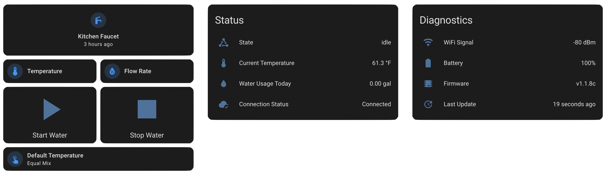
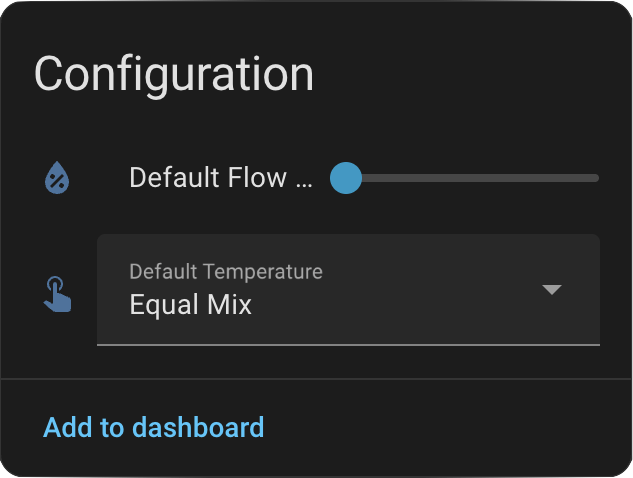
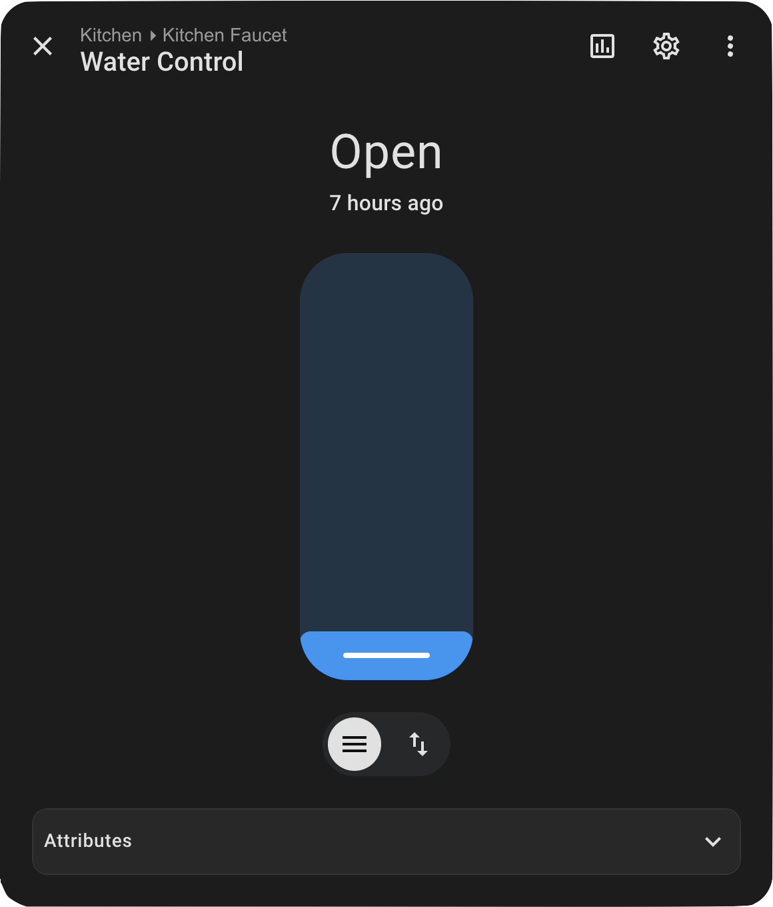
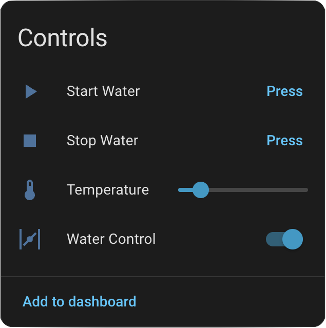
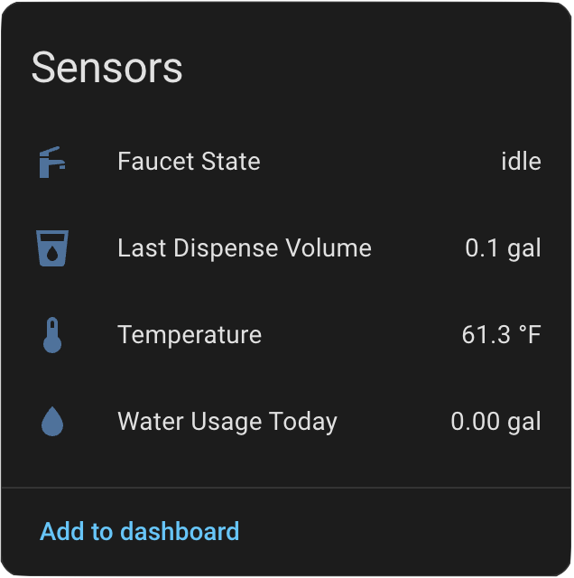
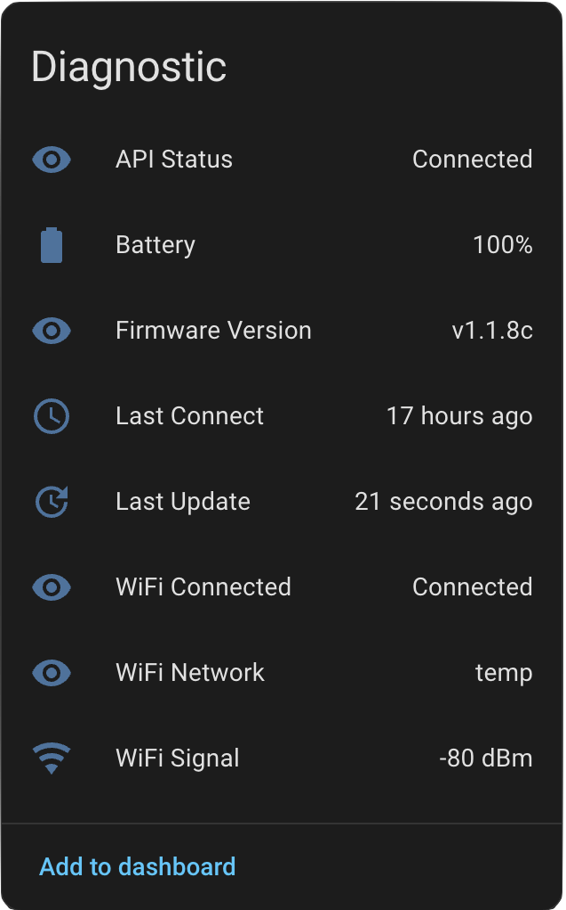

> [!IMPORTANT]
> Before setting up the integration, ensure your Moen Smart Water Network faucet is connected to your network and accessible via the Moen mobile app. This integration requires your Moen account credentials and uses the reverse-engineered official Moen cloud API.

# Moen Smart Water Integration for Home Assistant

[](https://github.com/custom-components/hacs)
[](https://www.home-assistant.io/)
[](https://github.com/alexbbt/ha-moen-smart-water/releases)
[](https://github.com/alexbbt/ha-moen-smart-water/blob/main/LICENSE)
[](https://developers.home-assistant.io/docs/creating_integration_manifest#iot-class)



### Smart Faucet Control Made Simple

* Complete water flow control with valve entity (open/close/position)
* Real-time temperature control and monitoring (°C)
* Adjustable flow rate control (10-100%)
* Volume-based dispensing (50-2000ml)
* Comprehensive diagnostic sensors (WiFi, Battery, Firmware, Cloud status)
* UI-based configuration

> [!WARNING]
> - This integration is **unofficial** and not affiliated with Moen
> - It requires your Moen account credentials to work
> - All communication goes through Moen's cloud services
> - Use at your own risk - may violate Moen's Terms of Service

## Requirements

* Home Assistant 2024.12.0 or later
* Moen Smart Water Network faucet connected to your home network
* Faucet registered with a Moen account
* Valid Moen account credentials

> [!NOTE]
> This integration has been tested with MotionSense Wave Kitchen Faucets (Cia model). It may work with other models in the same family. [Report other models](https://github.com/alexbbt/ha-moen-smart-water/issues/new).

## Installation

### Via [HACS](https://hacs.xyz/)
<a href="https://my.home-assistant.io/redirect/hacs_repository/?owner=alexbbt&repository=ha-moen-smart-water&category=integration" target="_blank"></a>

### Manually

1. Download the latest release from the [releases page](https://github.com/alexbbt/ha-moen-smart-water/releases)
2. Extract the `custom_components/moen_smart_water` folder
3. Place it in your Home Assistant `config/custom_components` directory
4. Restart Home Assistant

## Configuration

<a href="https://my.home-assistant.io/redirect/config_flow_start/?domain=moen_smart_water" target="_blank"></a>

1. Go to **Settings** → **Devices & Services**
2. Click **Add Integration**
3. Search for **Moen Smart Water**
4. Enter your Moen account credentials (username and password)
5. The integration will automatically discover your faucets



> [!TIP]
> **Finding Your Client ID:**
> * The integration provides a default value that should work for most users
> * If you encounter authentication issues, you may need to extract your specific client ID
> * Use a network monitoring tool (like mitmproxy) to capture traffic from the official Moen app
> * Look for API calls to `*.execute-api.us-east-2.amazonaws.com`
> * Find the `client_id` field in the login request
> * See [REVERSE_ENGINEERING.md](REVERSE_ENGINEERING.md) for detailed instructions

## Features

The integration automatically creates entities for each detected Moen Smart Water Network faucet:

### Valve Entity
- **Water Control**: Open/close valve to start/stop water flow
- **Flow Rate Position**: Adjustable position (0-100%) for precise flow control
- **Real-time Temperature Display**: Shows current water temperature



### Button Controls
- **Start Water**: Starts water flow with current settings
- **Stop Water**: Stops water flow immediately

### Number Entities
- **Temperature**: Set specific temperature (0-100°C, range adjusts based on learned device limits)
- **Default Flow Rate**: Set flow rate percentage (10-100%) used for gesture activation

### Select Entity
- **Default Temperature**: Choose default temperature mode for gesture activation
  - Handle Position: Use physical handle position
  - Coldest: Always use coldest available temperature
  - Equal Mix: Use 50/50 hot/cold mix



### Sensors
- **Faucet State**: Current operational state (idle, running, etc.)
- **Water Usage Today**: Daily cumulative water usage (liters)
- **Last Dispense Volume**: Volume of last dispense operation (milliliters)
- **Temperature**: Current water temperature (°C)
- **API Status**: Cloud connection status (Connected/Disconnected)
- **Last Update**: Timestamp of last successful data update
- **WiFi Network**: Connected WiFi network name
- **WiFi Signal**: WiFi signal strength (dBm)
- **WiFi Connected**: WiFi connection status
- **Battery**: Battery percentage (if applicable)
- **Firmware Version**: Device firmware version
- **Last Connect**: Timestamp of last cloud connection





### Entity Naming

Entities are automatically named in the format `{device_name}_{entity_type}`. Example entity names:

- `valve.kitchen_faucet_water_control`
- `button.kitchen_faucet_start_water`
- `button.kitchen_faucet_stop_water`
- `number.kitchen_faucet_temperature`
- `number.kitchen_faucet_default_flow_rate`
- `select.kitchen_faucet_default_temperature`
- `sensor.kitchen_faucet_faucet_state`
- `sensor.kitchen_faucet_water_usage_today`
- `sensor.kitchen_faucet_temperature`
- `sensor.kitchen_faucet_last_dispense_volume`
- `sensor.kitchen_faucet_api_status`
- `sensor.kitchen_faucet_battery`
- `sensor.kitchen_faucet_wifi_signal`

## Usage

### Actions

You can control the faucet programmatically using Home Assistant actions. All actions return optional response data that can be used in scripts and automations:

```yaml
# Start water - continuous flow (runs until manually stopped)
action: moen_smart_water.start_water
target:
  device_id: "your_device_id"
data:
  temperature: "coldest"  # or numeric like 25 for 25°C, or "hottest", "equal"
  flow_rate: 100          # 0-100%

# Dispense specific volume - auto-stops when volume reached (wave hand to start)
action: moen_smart_water.dispense_volume
target:
  device_id: "your_device_id"
data:
  volume_ml: 500       # Required: 50-2000ml
  temperature: 25      # Optional: "coldest", "hottest", "equal", or numeric °C
  flow_rate: 75        # Optional: 0-100%
  timeout: 120         # Optional: 10-300s (reserved for future use)

# Stop water flow
action: moen_smart_water.stop_water
target:
  device_id: "your_device_id"

# Set temperature
action: moen_smart_water.set_temperature
target:
  device_id: "your_device_id"
data:
  temperature: 25  # Temperature in Celsius
  flow_rate: 100   # Optional, 0-100%

# Set default flow rate (for gesture activation)
action: moen_smart_water.set_default_flow_rate
target:
  device_id: "your_device_id"
data:
  default_flow_rate: 50  # 0-100%

# Get device status
action: moen_smart_water.get_device_status
target:
  device_id: "your_device_id"

# Get user profile
action: moen_smart_water.get_user_profile
```

#### Response Data

All actions return optional response data that can be captured and used in subsequent automation steps:

```yaml
# Advanced usage: Capture and use response data in a script
script:
  dispense_and_notify:
    sequence:
      - action: moen_smart_water.dispense_volume
        target:
          device_id: "your_device_id"
        data:
          volume_ml: 500
        response_variable: dispense_result

      - action: notify.mobile_app
        data:
          message: >
            Water dispensing {{ 'started' if dispense_result.success else 'failed' }}.
            Status: {{ dispense_result.message }}
            Current state: {{ dispense_result.current_state }}

# Example: Using device status response
script:
  check_faucet_status:
    sequence:
      - action: moen_smart_water.get_device_status
        target:
          device_id: "your_device_id"
        response_variable: status

      - action: notify.mobile_app
        data:
          title: "Faucet Status"
          message: >
            Temperature: {{ status.shadow.reported.currentTemp }}°C
            Valve State: {{ status.shadow.reported.valveState }}
            Battery: {{ status.shadow.reported.batterySoc }}%
```

**Response Data Structure:**

All actions return a response with at least:
- `success` (boolean): Whether the action succeeded
- `message` (string): Human-readable message about the action result
- `device_id` (string): The Home Assistant device ID (for device-specific actions)
- `moen_device_id` (string): The Moen API device ID (for device-specific actions)
- `error` (string): Error message if the action failed (only present when `success` is false)

Additional action-specific fields:
- **start_water**: `temperature`, `flow_rate`, `current_state`
- **dispense_volume**: `volume_ml`, `timeout`, `current_state`
- **stop_water**: `current_state`
- **get_device_status**: `shadow` (complete device shadow data)
- **get_user_profile**: `profile` (user profile data)
- **set_temperature**: `temperature`, `flow_rate`, `current_state`
- **set_default_flow_rate**: `default_flow_rate`

> [!TIP]
> **Selecting Your Device:**
> * In the Home Assistant UI, you can use the device picker to select your faucet
> * In YAML, you can reference the device by its device_id
> * Device ID is visible in the device information page in Home Assistant
> * Use the `moen_smart_water.get_device_status` action to check device status and retrieve detailed information

### Automations

Example automations for common use cases:

```yaml
# Example 1: Open valve when motion is detected
- alias: "Start water on motion"
  trigger:
    - platform: state
      entity_id: binary_sensor.kitchen_motion
      to: "on"
  action:
    - action: valve.open_valve
      target:
        entity_id: valve.kitchen_faucet_water_control

# Example 2: Dispense specific volume (wave hand to start, auto-stops when volume reached)
- alias: "Dispense water for coffee"
  trigger:
    - platform: state
      entity_id: input_boolean.make_coffee
      to: "on"
  action:
    - action: moen_smart_water.dispense_volume
      target:
        device_id: "your_device_id"
      data:
        volume_ml: 500  # Required
        timeout: 120    # Optional

# Example 3: Set temperature based on time of day
- alias: "Morning warm water"
  trigger:
    - platform: time
      at: "07:00:00"
  action:
    - action: number.set_value
      target:
        entity_id: number.kitchen_faucet_temperature
      data:
        value: 35  # Warm temperature in Celsius

# Example 4: Adjust flow rate for gentle washing
- alias: "Gentle flow for delicates"
  trigger:
    - platform: state
      entity_id: input_boolean.gentle_mode
      to: "on"
  action:
    - action: valve.set_valve_position
      target:
        entity_id: valve.kitchen_faucet_water_control
      data:
        position: 20  # 20% flow rate
```

> [!NOTE]
> Replace `"your_device_id"` and entity IDs with your actual device/entity names. You can find device IDs in the Home Assistant logs or device information pages.

## Advanced Configuration

### Temperature Control

- **Temperature Number Entity**: Set specific temperature (0-100°C)
  - Range automatically adjusts based on your faucet's learned temperature limits
  - Works both when water is idle (sets for next use) and running (changes immediately)
- **Temperature Sensor**: Monitor current water temperature in real-time
- **Default Temperature Select**: Choose default temperature mode for gesture activation (Handle Position, Coldest, or Equal Mix)

### Flow Rate Control

The **Default Flow Rate** number entity sets the flow rate percentage (10-100%) used when activating the faucet via gesture controls (hand wave or handle). This is used when starting water flow without explicitly specifying a flow rate.

**Valve Position Control**: Use the valve entity to control flow rate in real-time (0-100%). Position is preserved across temperature changes, and 0% closes the valve.

**Enhanced Control vs. Official App:**
- The Home Assistant integration allows setting the default flow rate as low as **10%** (the device's trickle flow rate)
- The official Moen mobile app restricts this to a minimum of **30%**
- This provides finer control over water flow, useful for scenarios requiring minimal flow rates

> [!TIP]
> **Use Cases for Lower Flow Rates (10-30%):**
> - Hand washing and personal hygiene
> - Washing delicate items
> - Filling containers slowly to prevent splashing
> - Conserving water for routine tasks

### Device-Specific Timestamps

This integration provides device-specific timestamp sensors:
- **Last Update**: When the integration last successfully updated data from the Moen API
- **Last Connect**: When the faucet last connected to the Moen cloud

These sensors provide specific information about your faucet's connectivity and data freshness.

## Troubleshooting

To enable debug logging, add the following configuration to your `configuration.yaml` file:

```yaml
logger:
  default: warning  # Default log level for all components
  logs:
    custom_components.moen_smart_water: debug    # Enable debug logging for this integration
```

> [!WARNING]
> **Common Issues:**
> * Ensure the faucet is powered on and connected to your network
> * Verify your Moen account credentials are correct
> * Check that the faucet is online in the official Moen mobile app
> * Try using the default client ID first
> * Check Home Assistant logs for any error messages
> * Some faucet features may not be available on all models

## Security

- Credentials are stored securely in Home Assistant's configuration (encrypted)
- All communication uses HTTPS/TLS
- No local network access required
- OAuth tokens are used for authentication after initial login

## Contributing

This integration is based on reverse-engineering the official Moen mobile app. If you have additional information about the API or encounter issues, please:

1. Check the existing [issues](https://github.com/alexbbt/ha-moen-smart-water/issues)
2. Create a new issue with detailed information
3. Include relevant logs and network captures (sanitized)

### Reverse Engineering Guide

For developers interested in understanding how the Moen API was reverse-engineered or contributing API improvements, see [REVERSE_ENGINEERING.md](REVERSE_ENGINEERING.md) for a complete guide on capturing and analyzing Moen SmartWater API traffic using mitmproxy.

### Development Setup

This project uses pre-commit hooks to ensure code quality and consistency. To set up the development environment:

#### Create and activate virtual environment
```bash
# Create virtual environment
python3 -m venv venv

# Activate virtual environment
# On macOS/Linux:
source venv/bin/activate
# On Windows:
# venv\Scripts\activate
```

#### Install pre-commit
```bash
pip install pre-commit
```

#### Install git hooks
```bash
pre-commit install
```

#### Run pre-commit on all files
```bash
pre-commit run --all-files
```

The pre-commit hooks will automatically:
- Run **ruff** for code linting and formatting
- Run **mypy** for type checking
- Ensure code follows the project's style guidelines

> [!TIP]
> Pre-commit hooks will run automatically on every commit. If you want to commit code that doesn't pass the checks, use `git commit --no-verify` (not recommended for regular development).

#### Manual Testing
You can also run the linting tools manually:

```bash
# Make sure virtual environment is activated
source venv/bin/activate  # On macOS/Linux
# venv\Scripts\activate  # On Windows

# Install test dependencies (if not already installed)
pip install -r requirements-test.txt

# Run ruff (code linting)
ruff check custom_components

# Run mypy (type checking)
mypy custom_components
```

## Disclaimer

This integration is not officially supported by Moen. Use at your own risk. The authors are not responsible for any damage or issues that may arise from using this integration.

## License

This project is licensed under the MIT License - see the LICENSE file for details.
